Full-stack software developer from the Netherlands. I build practical web
products using TypeScript, React, Rust, Laravel, GraphQL and PostgreSQL.

Currently building Macro Tracker, Safascord and my Rust-first portfolio.

  
  

